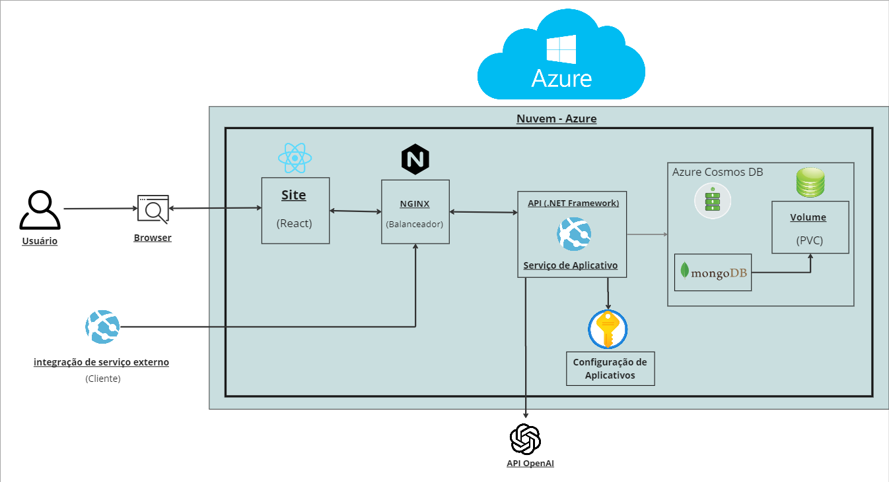

# Descrição

Sabe quando você está consumindo um treinamento e não entende aquela parte do conteúdo ? O que você faz ? Abre um tópico no fórum da plataforma e aguarda algum instrutor ou colaborador da comunidade lhe responder enquanto continua consumindo o treinamento com dúvidas ? Navega na internet em busca de respostas e fica mais confuso ? E se a plataforma fosse capaz de lhe fornecer outro exemplo ou explicação em instantes ?
O projeto IAcademy integra a inteligência artificial da OpenAI para resolver esses problemas e proporcionar uma experiência de aprendizado mais produtiva. Utilizando o maior potêncial de uma inteligência artificial generativa treinada, tornou-se possível oferecer suporte 24/7 para suplir essas necessidades que o usuário possa vir a ter, de forma automatizada. Além de oferecer grande suporte para a rápida criação de novos treinamentos e gerenciamento de treinamentos já existentes a um custo operacional incrivelmente menor!

# Arquitetura



# Deploy dessa API .NET no Azure App Service

Abaixo o paasso a passo de como fazer deploy desse aplicação .NET diretamente no Azure App Service:

## Pré-requisitos

1. **Instale o Azure CLI**: Verifique a instalação com o comando:0
   ```sh
   az --version
   ```

2. **Instale o .NET 7.0 SDK**: Verifique a instalação com o comando:
   ```sh
   dotnet --version
   ```

3. **Login no Azure**: Faça login na sua conta Azure com o comando:
   ```sh
   az login
   ```

## Preparação

4. **Clone o Repositório**: Abra o terminal e navegue até a pasta que deseja clonar o projeto. Clone o projeto contido nesse repositório utilizando o comando abaixo:
	```sh
	git clone https://github.com/Inoxybel/iacademy.git
	```

5. **Construir a Aplicação**: Navegue até a pasta do projeto onde contém o arquivo `.sln` do projeto .NET e construa a aplicação com o comando:
   ```sh
   dotnet publish -c Release
   ```

## Deploy

6. **Criar Grupo de Recursos**: Crie um grupo de recursos no Azure com o comando:
   ```sh
   az group create --name nome-do-seu-grupo-de-recursos --location sua-regiao
   ```

7. **Criar Plano de Serviço de Aplicativo**: Crie um plano de serviço de aplicativo com o comando:
   ```sh
   az appservice plan create --name nomeDoSeuPlanoDeServico --resource-group nome-do-seu-grupo-de-recursos --sku FREE
   ```

8. **Criar Aplicativo Web**: Crie um aplicativo web com o comando:
   ```sh
   az webapp create --resource-group nome-do-seu-grupo-de-recursos --plan nomeDoSeuPlanoDeServico --name nomeDoSeuAplicativoWeb
   ```

9. **Deploy da Aplicação**: Faça o deploy da sua aplicação usando o comando:
   ```sh
   az webapp up --name nomeDoSeuAplicativoWeb --sku F1 --html
   ```

## Verificação

10. **Acesse sua API**: Agora você deve ser capaz de acessar sua API através do URL do aplicativo web:
   ```
   https://nomeDoSeuAplicativoWeb.azurewebsites.net
   ```

# Uso da aplicação:

## Endpoints

[Clique aqui](./docs/Endpoints_readme.md) para acessar a documentação dos endpoints.

