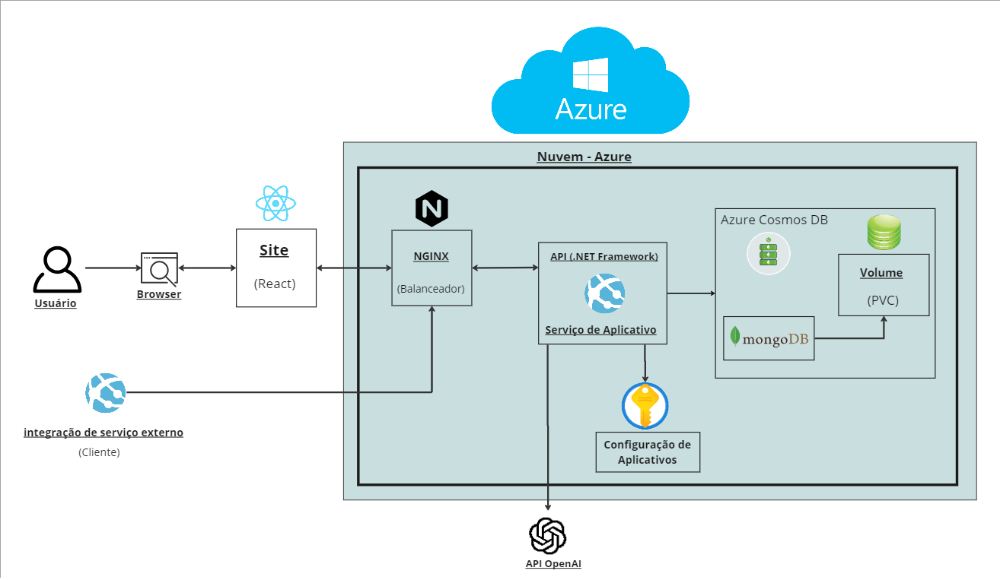

# Descrição

Sabe quando você está consumindo um treinamento e não entende aquela parte do conteúdo ? O que você faz ? Abre um tópico no fórum da plataforma e aguarda algum instrutor ou colaborador da comunidade lhe responder enquanto continua consumindo o treinamento com dúvidas ? Navega na internet em busca de respostas e fica mais confuso ? E se a plataforma fosse capaz de lhe fornecer outro exemplo ou explicação em instantes ?
O projeto IAcademy integra a inteligência artificial da OpenAI para resolver esses problemas e proporcionar uma experiência de aprendizado mais produtiva. Utilizando o maior potêncial de uma inteligência artificial generativa treinada, tornou-se possível oferecer suporte 24/7 para suplir essas necessidades que o usuário possa vir a ter, de forma automatizada. Além de oferecer grande suporte para a rápida criação de novos treinamentos e gerenciamento de treinamentos já existentes a um custo operacional incrivelmente menor!

# Arquitetura



# Deploy dessa API .NET no Azure App Service

Abaixo o passo a passo de como fazer o clone e uso dessa aplicação .NET em conjunto com um banco de dados na Azure:

## Pré-requisitos

1. **Instale o Azure CLI**: Verifique a instalação com o comando:0
   ```sh
   az --version
   ```

2. **Instale o .NET 7.0 SDK**: Verifique a instalação com o comando:
   ```sh
   dotnet --version
   ```

3. **Login no Azure**: Faça login na sua conta Azure com o comando:
   ```sh
   az login
   ```

## Preparação

4. **Clone o Repositório**: Abra o terminal e navegue até a pasta que deseja clonar o projeto. Clone o projeto contido nesse repositório utilizando o comando abaixo:
   ```sh
   git clone https://github.com/Inoxybel/iacademy.git
   ```
   
## Base

5. **Criar Grupo de Recursos**: Crie um grupo de recursos no Azure com o comando:
   ```sh
   az group create --name nome-do-seu-grupo-de-recursos --location sua-regiao
   ```
   
6. **Criar uma Instância do Azure Cosmos DB**: Crie um recurso do serviço Cosmos DB para MongoDB:
   ```sh
   az cosmosdb create --name nomeDoSeuCosmosDB --resource-group nome-do-seu-grupo-de-recursos --kind MongoDB --locations regionName=sua-regiao failoverPriority=0 isZoneRedundant=False
   ```
   
7. **Obter a Connection String**: Recupere a String de Conexão que será usada na aplicação para que ela possa se conectar ao banco de dados na nuvem:
   ```sh
   az cosmosdb keys list --name nomeDoSeuCosmosDB --resource-group nome-do-seu-grupo-de-recursos --type connection-strings
   ```

8. **Configurar Connection String no Projeto**: 

   - Abra o arquivo appsettings.Development.json localizado em Application/IAcademyAPI/

   - Na linha:
   ```sh
   "IAcademy:Mongo:ConnectionString": "mongodb://localhost:27017",
   ```

Troque o valor "mongodb://localhost:27017" pela ConnectionString copiada no passo 8 e salve o arquivo.


## Verificação

9. **Acesse sua API**: Agora use o SDK dotnet instalado para compilar e rodar a aplicação:

   - Ainda estando no diretório Application/IAcademyAPI/ , execute o seguinte comando:
   ```sh
   dotnet run IAcademyAPI.csproj
   ```

   Acesse a URL: http://localhost:5210/swagger
 
## Disclaimer

Na linha:
   ```sh
   "IAcademy:ExternalServices:OpenAI:SecretKey": "SECRET_FROM_OPENAI"
   ```

   Você deve colocar sua API Key obtida direto no site da OpenAI após se cadastrar, no link: https://platform.openai.com/account/api-keys

   Caso contrário não conseguirá utilizar os endpoints da controller AI, apenas conseguirá utilizar os endpoints de CRUD direto com o banco de dados.

# Uso da aplicação:

## Endpoints

[Clique aqui](./docs/Endpoints_readme.md) para acessar a documentação dos endpoints.

